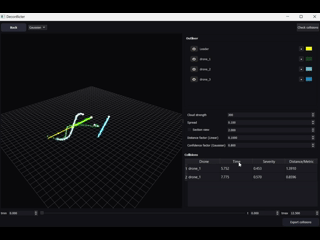

# UAV Strategic Deconfliction System

## Overview

This repository contains an implementation of a strategic deconfliction system for unmanned aerial vehicles (UAVs) in shared airspace, developed as part of the FlytBase Robotics Assignment 2025. The system verifies whether a primary drone's waypoint-based mission is safe to execute by checking for potential conflicts in space and time against simulated trajectories of other drones. It supports both deterministic (linear) and probabilistic (Gaussian) collision detection methods, ensuring robustness in scenarios with positional and velocity uncertainties.

The primary mission is defined by waypoints with spatial coordinates (x, y, z) and an overall time window [T_start, T_end]. Simulated drone schedules are provided via JSON files, including waypoints and timings. The system detects conflicts, provides detailed explanations, and offers visualizations for clear understanding.

Key components include:
- Two collision detection engines: Linear (deterministic paths) and Gaussian (probabilistic clouds).
- Command-line interfaces (CLIs) for quick checks.
- A graphical user interface (GUI) application for 4D visualizations (3D space + time).
- A dataset generator for creating test scenarios.

This implementation addresses the assignment's requirements, including spatial and temporal checks, conflict explanations, simulations, and extra credit for 4D visualization. It was developed with modularity and scalability in mind.



## Features

- **Conflict Detection**:
  - Spatial validation: Ensures paths do not intersect within a configurable safety buffer.
  - Temporal validation: Checks for overlaps in time segments within the mission window.
  - Dual modes:
    - Linear: Uses cubic spline interpolation for exact distance-based checks.
    - Gaussian: Models uncertainty with covariance matrices, supporting velocity data for probabilistic assessments.
- **Detailed Reporting**: Returns status ("Clear" or "Collision") with conflict details, including locations, times, severity scores (0-1), and involved drones.
- **Visualization**: PyQt-based 3D viewer with time slider for dynamic simulations, highlighting conflicts.
- **Dataset Generation**: GUI tool to create JSON datasets with controlled collisions (none, single, or multiple).
- **Scalability Considerations**: Designed for extension to large-scale deployments, with discussions on distributed architectures.
- **Extra Credit**: 4D simulation for spatio-temporal conflict evolution.

## Requirements

- Python 3.12 or later.
- Dependencies: Install via `pip install numpy scipy matplotlib pyqt5 pyqtgraph argparse json pathlib typing collections`.
- No additional installations required; the system is lightweight and runs on standard hardware.

## Installation

1. Clone the repository:
   ```
   git clone [repository-url]
   cd [repository-directory]
   ```
2. Install dependencies:
   ```
   pip install -r requirements.txt
   ```
   (If no `requirements.txt` is present, use the list above.)

## Usage

### 1. Generating Test Data (validator.py)
Use this GUI tool to create simulated datasets for testing.

- Run: `python validator.py`
- Interface:
  - Select collision type: "No collision", "Single point collision", or "Multi point collision".
  - Set number of drones (1-30).
  - Choose dataset type: 0 (position only) or 1 (position + velocity).
  - Define time bounds: tmin and tmax.
- Output: Saves `drone_points.json` (simulated drones), `leader.json` (primary drone), and `results.json` (ground truth conflicts) to a selected folder.

This tool supports the assignment's requirement for hardcoded or file-based simulated flight schedules.


### 2. Command-Line Interfaces (CLIs)
For quick, non-interactive checks.

- **Linear Mode (dpcli.py)**:
  ```
  python dpcli.py --dfile drone_points.json --lfile leader.json [--point] [--tmin X] [--tmax Y] [--dist Z]
  ```
  - `--dfile/-d`: Path to simulated drones JSON (required).
  - `--lfile/-l`: Path to primary drone JSON (required).
  - `--point/-p`: Output detailed JSON with conflict info (t_rep, severity, d_min).
  - `--tmin/-n`, `--tmax/-m`: Optional time bounds for checks.
  - `--dist/-s`: Distance threshold (default: 1.0).
  - Output: "Clear" or "Collision" (summary), or detailed JSON.

- **Gaussian Mode (gpcli.py)**:
  ```
  python gpcli.py --dfile drone_points.json --lfile leader.json --type T [--point] [--tmin X] [--tmax Y] [--conf C]
  ```
  - `--type/-t`: 0 (position only) or 1 (position + velocity; default: 0).
  - `--conf/-c`: Confidence level (default: 0.95).
  - Other arguments as above.
  - Output: Similar to linear, with probabilistic metrics (m2_min).

These provide the query interface, returning status and details as specified.

### 3. Visualization Application (deconflictor.py)
For interactive 4D simulations and visualizations.

- Run: `python deconflictor.py`
- Interface:
  - Load drones and leader JSON files via buttons.
  - Toggle modes: Linear or Gaussian.
  - Adjust parameters: Distance factor, confidence level, cloud strength, width (for time sections).
  - Visibility controls: Show/hide drones, waypoints, leader path.
  - Time slider: Scrub through the timeline to view trajectories, moving positions, and evolving clouds.
  - Conflicts table: Live updates with drone ID, time, severity, and metric; color-coded for quick insight.
  - Export: Save collision details as CSV or JSON.
- Demonstrations: View conflict-free missions vs. detected conflicts with highlights.
- Video/Graph Output: Use screen recording tools to capture animations; the app generates plotted graphs in real-time.

This fulfills the simulation and visualization requirements, including highlighted conflict areas and multiple scenarios.


## How It Works

### Data Flow
1. **Input Parsing**: Load primary mission (waypoints, time window) and simulated drones from JSON.
2. **Trajectory Construction**:
   - Use SciPy's CubicSpline to interpolate smooth paths: x(t), y(t), z(t).
   - In Gaussian mode, incorporate velocity for covariance-based uncertainty modeling.
3. **Conflict Detection**:
   - **Spatial Check**: Sample paths and compute minimum distances (Euclidean in linear; Mahalanobis in Gaussian).
   - **Temporal Check**: Evaluate overlaps within the mission time window.
   - Optimization: Use SciPy's minimize_scalar for closest approach times.
   - Severity: Normalized score based on proximity or probability.
4. **Output**: Status with explanations; visualizations highlight conflicts.

### Key Classes
- **DronePath.py**: Linear engine for spline-based deterministic checks.
- **GaussianPoints.py**: Gaussian engine for probabilistic modeling, including cloud sampling.
- Assumptions:
  - Position + velocity data enhances accuracy; falls back if velocity is absent.
  - Missing values are filled with means for continuity.
  - Cubic splines ensure realistic, curved trajectories.

## Scalability Discussion

The current implementation is efficient for small to medium datasets (e.g., dozens of drones) with O(N_drones * N_samples) complexity. For large-scale deployment (e.g., tens of thousands of commercial drones):

- **Architectural Changes**: Adopt distributed computing (e.g., via cloud platforms like AWS or Kubernetes) to partition airspace sectors across nodes.
- **Enhancements**:
  - Real-time data ingestion: Use streaming pipelines (e.g., Apache Kafka) for live flight schedules.
  - Fault Tolerance: Implement redundancy with database replication (e.g., PostgreSQL) and load balancing.
  - Algorithm Scalability: Integrate spatial indexing (e.g., R-trees or quad-trees) for faster queries; GPU acceleration for Gaussian sampling.
  - Conflict Resolution: Parallelize checks with multiprocessing; approximate methods (e.g., FAISS for nearest neighbors) for high volume.

This design allows seamless scaling to enterprise-level UAV traffic management.

## License

This repository is provided under the MIT License.

## Contributing and License

Contributions are welcome. Please submit pull requests for improvements. 

For questions or issues, open a GitHub issue.
